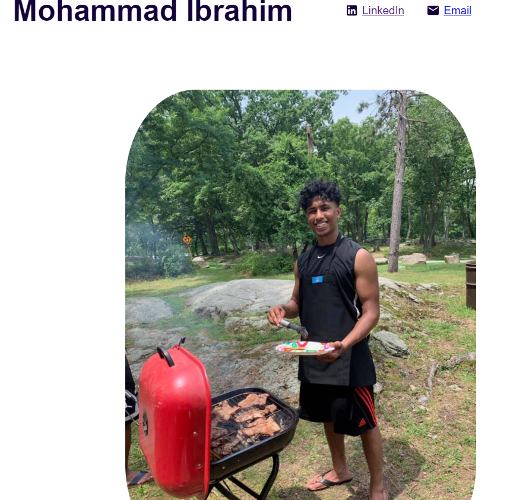

# Portfolio 
## Hey I'm Mohammad Ibrahim, Check Out my portfolio below

## Deployed Site 
---fix heroku---

## Description 
My portfolio is made with React & sass. It is deployed with Express & Heroku.  
My portfolio contains info about me, the projects which I have completed, as well as a link to my resume.  I hope you enjoy getting to learn a bit about me.   
  

## Table of Contents
* [Installation](#installation)
* [Usage](#usage)
* [Technologies](#technologies)
* [License](#license)
* [Questions](#questions)
* [Website](#website)
* [Contribution](#contribution)

## Installation
In order to install this project, you must login to GitHub and go to https://github.com/mibrahim234/PortfolioReact2022. Once there you will click on the green button that says clone or download. You will be given choices on how to download: using the ssh/html key or downloading the zip file.

Using SSH/HTML Key: You will copy the link shown and open up either terminal (mac: pre-installed) or gitbash (pc: must be installed). Once the application is open, you will type git clone paste url here. Once you have cloned the git team-generator repo, cd into the repo and type "open . for mac" Or "code . for windows" to open the folder which contains all files used for the website.

Using Download ZIP: Click on Download Zip. Locate the file and double click it to unzip the file. Locate the unzipped folder and and open it. All the files for the website will be within this folder. 

---

## Usage 

- To use the application locally, enter npm start in the root of the repo to initialize the app.  
Once the app has been initialized, react will open it up in the browser.

---

## Technologies
- [React](https://reactjs.org/)
- [Sass](https://sass-lang.com/)
- [Express](https://expressjs.com/)
- [Heroku](https://heroku.com/)

## License
Copyright (c) [2022]
The license is MIT License. 
Read more about it at https://opensource.org/licenses/MIT.

## Questions
- Please reach out through github or by email. 

- [mibrahim234](https://github.com/mibrahim234) 

- mohamm1417@gmail.com

## Website
[Link to the GIT repository](https://github.com/mibrahim234/PortfolioReact2022)

## Contribution
Made with ❤️ by Mohammad Ibrahim 